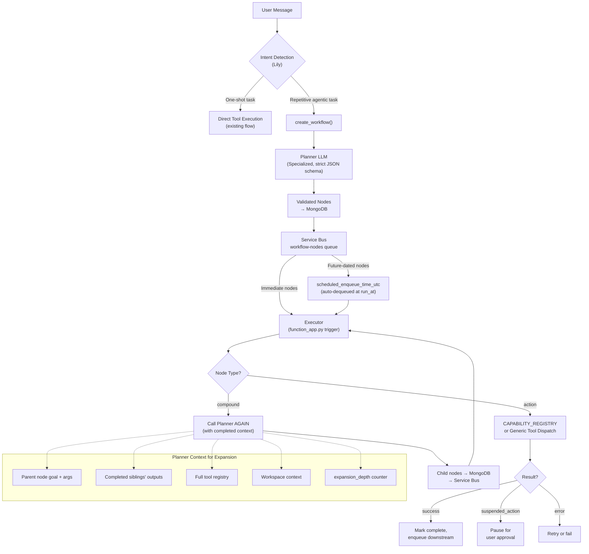

# Workflow Architecture Overhaul — Unified Autonomous Execution Engine

## Problem Statement

The current workflow system is fragmented and limited:

1. **Three Disconnected Brains**: `marketing_agent.py` (chat supervisor), `workflow_planner.py` (skeleton LLM), and `workflow_executor.py` (capability runner) each have independent, uncoordinated logic.
2. **Hardcoded Capabilities**: The executor only knows 8 hardcoded capabilities (`draft_post`, `publish_post`, `check_platform_connection`, etc.). When the planner suggests an action like `send_email` or `web_search`, the executor falls through to a generic `tool.invoke()` with no intelligence.
3. **No Recursive Expansion**: The system does a single milestone → leaf expansion (`execute_posts_milestone` creates `draft_post` + `publish_post` pairs). There's no ability for a node to spawn further sub-workflows or child DAGs.
4. **Content Pipeline Disconnect**: Content generated by the workflow engine (via `_cap_draft_post`) uses completely different prompting than the interactive Content Creation Pipeline. Persona, brand context, and styling are inconsistent.
5. **Immediate Tasks Bypass Workflows**: When the user asks "fetch latest updates about LLM every day and email me a report", the agent creates `schedule_task` entries directly instead of modeling it as a workflow.

### ⚠️ CRITICAL BUG: Service Bus Scheduling Is Not Used for Workflow Nodes

**Finding:** The `workflow-nodes` Service Bus queue exists and has a consumer triggered in `function_app.py:1534-1560`, but **workflow nodes with `schedule.run_at` are NEVER sent to Service Bus with `scheduled_enqueue_time_utc`**.

| What Works | What's Broken |
|---|---|
| ✅ `workflow-nodes` queue exists with a consumer in `function_app.py:1534-1560` | ❌ No `scheduled_enqueue_time` is ever set for workflow node messages |
| ✅ `_enqueue_node()` sends messages to the queue | ❌ The message goes immediately — `run_at` is never used when sending to Service Bus |
| ✅ `NodeSchedule.run_at` field exists on the model | ❌ Scheduling is done via Python time filtering in `get_pending_nodes_ready_to_run` (line 253: `if now < run_at: continue`) — i.e., it just skips future nodes when polling, instead of scheduling them on Service Bus |
| ✅ The marketing task system (`schedule_task`) DOES use `scheduled_enqueue_time_utc` properly | ❌ The workflow system never adopted this pattern |

**How Scheduling Currently (Failing) Works:**
- Node has `schedule.run_at` = 5 days from now.
- When Lily calls `run_next_workflow_step`, `get_pending_nodes_ready_to_run` checks if `now < run_at: continue` — node is skipped.
- Next time the user comes back (or the workflow is polled), the check runs again.
- There's no background trigger to auto-execute future nodes — they only run when the user interacts and Lily calls `run_next_workflow_step`.
- **Result:** Future-dated nodes (Day 7, Day 14 posts) never auto-execute unless the user comes back and triggers the check.

---

## Design Decisions (Resolved)

### Decision 1: Keep the Specialized Planner LLM & Strict JSON Schemas for Accuracy ✅

To ensure accuracy when creating workflows, we split the planning responsibility:

```
LILY (Marketing Agent)                    PLANNER (Specialized LLM)
──────────────────────                    ─────────────────────────
• Detects "this needs a workflow"         • Receives: goal + tool_registry + context
• Extracts: title, objective, platforms     • Has: strict JSON schema + validation
• Calls: create_workflow(...)               • Outputs: validated node list
• Does NOT produce node JSON              • Only job: produce correct DAG JSON
                                          • No chat, no tools, no distractions
```

- **Why this works better than Lily doing it**: Lily has 40+ tools, a massive system prompt, PDF handling, persona context, pipeline interception, ads management, etc. Asking her to also reliably produce structured workflow JSON is a recipe for hallucinated node names, missing dependencies, and broken DAGs.
- **The Planner LLM**: The planner prompt is ~200 lines max — clean, focused, schema-constrained. It gets the full tool registry with argument schemas, so it can only produce nodes that map to real tools. Its output is JSON-schema validated before being inserted into MongoDB.
- **Lily's role**: Lily's job is just to call `create_workflow` with the right title, primary_objective, and goals — which she's already good at.
- **The skill file (`SKILL.md`)** teaches Lily WHEN to create workflows (any repetitive agentic task) and WHAT information to pass to `create_workflow` (title, objective, platforms, audience, duration). The skill does NOT teach Lily HOW to structure the DAG nodes. That's the planner's job.

### Decision 2: State-Aware Recursive & Nested DAG Node Expansion ✅

Yes! The workflow node tree supports **recursive multi-level expansions (expansion depth > 1)**. Compound nodes can spawn other compound nodes, which are then expanded sequentially down the tree as the execution engine progresses.

#### Recursive Expansion Tree Example:
```
[Depth 0: Skeleton]     Milestone A (Action) ──► Milestone B (Compound) ──► Milestone F (Action)
                                                    │
                                                    ▼ (Expansion Depth 1)
[Depth 1: Sub-DAG]                                Node C (Compound) ──► Node D (Action)
                                                    │
                                                    ▼ (Expansion Depth 2)
[Depth 2: Leaves]                                 Node E (Action)
```

1. **Top-Level Milestone DAG (Depth 0)**:
   - **Milestone A** (Action: check email configuration)
   - **Milestone B** (Compound: execute marketing campaign)
   - **Milestone F** (Action: compile performance report)
   - *Dependency*: `F` depends on `B`; `B` depends on `A`.

2. **First Level of Expansion (Depth 1)**:
   - When **Milestone B** executes, the Executor detects `node_type="compound"`, increments the depth counter to `1`, and calls the planner.
   - The planner returns a sub-DAG consisting of **Node C** (Compound: create and publish newsletter) and **Node D** (Action: verify platform traffic).
   - **Node D** depends on **Node C**.
   - The executor inserts `C` and `D` into MongoDB, marks `B` completed, and **rewires dependencies**: Milestone `F` is modified to depend on `D` (the final leaf of `B`'s expansion).

3. **Second Level of Expansion (Depth 2)**:
   - When **Node C** executes, the Executor again detects `node_type="compound"`, increments the depth counter to `2` (`<= max_expansion_depth = 3`), and calls the planner.
   - The planner returns **Node E** (Action: draft, review, and send email).
   - The executor inserts `E` into MongoDB, marks `C` completed, and **rewires dependencies**: Node `D` (which depended on `C`) is modified to depend on `E`.

#### The Complete Expansion Flow:

```
                                  ┌─────────────────────────────┐
                                  │    MongoDB: Workflow Nodes   │
                                  └─────────────────────────────┘
                                            ▲
                                            │ writes child nodes
┌──────────────┐   calls tool   ┌───────────┴───────────┐
│     Lily     │ ──────────────►│   Executor            │
│ (Chat Agent) │                │   execute_node_sync() │
└──────────────┘                └───────────▼───────────┘
                                            │
                                  sees node_type = "compound"
                                            │
                                            ▼
                                  ┌─────────────────────┐
                                  │   Planner LLM Call   │
                                  │   (with context of   │
                                  │    completed nodes'  │
                                  │    outputs +         │
                                  │    remaining goals)  │
                                  └─────────────────────┘
                                            │
                                    returns child nodes
                                            │
                                            ▼
                                  ┌─────────────────────────┐
                                  │ Child nodes inserted    │
                                  │ into DB; downstream     │
                                  │ edges rewired to wait   │
                                  │ for nested leaves       │
                                  └─────────────────────────┘
```

**Context Propagation & Safety Constraints:**
- **Context propagation**: Child nodes get their parent's and sibling's outputs via `%web_search%` placeholders in arguments.
- **Safety Limit**: `expansion_depth` is tracked on every node. Recursion is limited to `max_expansion_depth = 3` to prevent infinite expansion loops from bad LLM plans.
- **Topological Integrity**: The dependency rewiring mechanism ensures the DAG remains topologically sorted at all times.

### Decision 3: Workflow Triggers — Repetitive Agentic Tasks ✅

A workflow is created when the user asks for any **repetitive agentic task** that requires the agent to perform actions over time:
- "Fetch latest AI news daily and email me a summary" → Workflow
- "Run a 2-week LinkedIn campaign" → Workflow
- "Monitor competitor posts weekly and draft responses" → Workflow
- "Publish this post to LinkedIn" → Direct execution (one-shot, not repetitive)
- "Summarize this article" → Direct execution (one-shot)

### Decision 4: Service Bus Scheduled Delivery for True Background Scheduling (No Cron needed) ✅

The `workflow-nodes` Service Bus queue already exists with a consumer trigger (`workflow_node_executor` in `function_app.py`). We will leverage Service Bus native scheduling:
1. When enqueuing future-dated nodes, `_enqueue_node` will compute the target delivery time (`schedule.run_at`).
2. If `run_at` is in the future, the message is sent using `scheduled_enqueue_time_utc` (or via `sender.schedule_messages()`), matching the pattern implemented in `MarketingTaskScheduler`.
3. We will remove the Python-level local timezone filtering from `get_pending_nodes_ready_to_run` so the DB query doesn't block future-dated nodes, letting the Service Bus queue trigger handle background wakeups naturally.

---

## Proposed Changes

### Component 1: Fix Service Bus Scheduling for Workflow Nodes (Bug Fix)

> [!CAUTION]
> This is the highest priority fix. Without it, multi-day campaigns never auto-execute future nodes.

#### [MODIFY] [workflow_executor.py](file:///d:/Active/Docu3C/V2/InfluenzeAI_Agent/Backend/Services/Workflow/workflow_executor.py)

**Fix `_enqueue_node` (line 1089) and `_enqueue_node_sync` (line 1330):**

```python
async def _enqueue_node(workspace_id: str, workflow_id: str, node_id: str, 
                        scheduled_time: datetime = None):
    """Send a node execution message to the workflow-nodes Service Bus queue.
    If scheduled_time is provided, uses Service Bus scheduled delivery."""
    try:
        conn_str = os.getenv("SERVICE_BUS_CONNECTION_STRING")
        if not conn_str:
            # Local fallback — if scheduled, defer via asyncio
            if scheduled_time and scheduled_time > datetime.now(timezone.utc):
                delay = (scheduled_time - datetime.now(timezone.utc)).total_seconds()
                asyncio.get_event_loop().call_later(
                    delay,
                    lambda: asyncio.create_task(
                        execute_workflow_node(workspace_id, workflow_id, node_id, DatabaseManager())
                    )
                )
                return
            # Execute immediately
            db = DatabaseManager()
            asyncio.create_task(
                execute_workflow_node(workspace_id, workflow_id, node_id, db)
            )
            return
        
        from azure.servicebus.aio import ServiceBusClient
        from azure.servicebus import ServiceBusMessage
        payload = json.dumps({...})
        msg = ServiceBusMessage(payload)
        
        # USE SCHEDULED DELIVERY for future-dated nodes
        if scheduled_time and scheduled_time > datetime.now(timezone.utc):
            msg.scheduled_enqueue_time_utc = scheduled_time
        
        async with ServiceBusClient.from_connection_string(conn_str) as sb:
            async with sb.get_queue_sender("workflow-nodes") as sender:
                seq = await sender.schedule_messages(msg, scheduled_time) if scheduled_time else None
                if not scheduled_time:
                    await sender.send_messages(msg)
                    
                # Store sequence number on node for cancellation support
                if seq:
                    db = DatabaseManager()
                    col = db.workflows._nodes(workspace_id)
                    col.update_one(
                        {"node_id": node_id},
                        {"$set": {"schedule.service_bus_sequence_number": seq[0]}}
                    )
    except Exception as e:
        logger.error(f"[WorkflowExecutor] Failed to enqueue node {node_id}: {e}")
```

**Fix `_enqueue_ready_nodes` to pass `schedule.run_at`:**

```python
async def _enqueue_ready_nodes(workflow_id: str, workspace_id: str, db: DatabaseManager):
    """Enqueue all pending nodes whose dependencies are satisfied.
    Future-dated nodes are sent with scheduled_enqueue_time_utc."""
    all_nodes = db.workflows.get_workflow_nodes(workflow_id, workspace_id)
    completed_ids = {n.node_id for n in all_nodes if n.status in ("completed", "skipped")}
    
    for node in all_nodes:
        if node.status != "pending":
            continue
        if not all(dep in completed_ids for dep in node.depends_on):
            continue
        
        scheduled_time = None
        if node.schedule and node.schedule.run_at:
            scheduled_time = node.schedule.run_at
            if scheduled_time.tzinfo is None:
                scheduled_time = scheduled_time.replace(tzinfo=timezone.utc)
        
        await _enqueue_node(workspace_id, workflow_id, node.node_id, 
                           scheduled_time=scheduled_time)
```

**Remove the Python-level time filtering from `get_pending_nodes_ready_to_run`** — this is no longer needed because Service Bus handles the scheduling.

---

### Component 2: Tool Registry — Make Tools Discoverable

#### [MODIFY] [marketing_tools.py](file:///d:/Active/Docu3C/V2/InfluenzeAI_Agent/Backend/Agents/Tools/marketing_tools.py)

Add a `get_tool_registry()` function that returns structured metadata for every tool the workflow engine can invoke. This is consumed by:
- The **planner LLM prompt** (full tool awareness)
- The **executor's generic dispatch** (validation)

```python
def get_tool_registry() -> list[dict]:
    """Return structured metadata for every tool the workflow engine can invoke."""
    registry = []
    for tool in LLM_EXPOSED_TOOLS:
        schema = tool.args_schema.schema()
        registry.append({
            "name": tool.name,
            "description": tool.description[:200],
            "arguments": {
                k: {"type": v.get("type", "any"), "required": k in schema.get("required", [])}
                for k, v in schema.get("properties", {}).items()
            },
            "category": _categorize_tool(tool.name),
        })
    return registry

def _categorize_tool(name: str) -> str:
    """Categorize a tool for the planner's reference."""
    categories = {
        "publish_to_": "publishing",
        "search_": "research", "scrape_": "research", "web_search": "research",
        "get_news": "research", "get_reddit": "research", "fetch_youtube": "research",
        "send_email": "communication",
        "schedule_task": "scheduling",
        "check_platform": "verification",
        "fetch_platform": "analytics",
    }
    for prefix, cat in categories.items():
        if name.startswith(prefix) or name == prefix:
            return cat
    return "general"
```

---

### Component 3: Shared Content Generation Helper

#### [NEW] [content_helpers.py](file:///d:/Active/Docu3C/V2/InfluenzeAI_Agent/Backend/Services/Workflow/content_helpers.py)

Extract the content generation logic currently duplicated between `_cap_draft_post` (workflow_executor.py:245-568) and the interactive Content Creation Pipeline into a shared helper. This ensures workflow-generated and interactive-generated content are identical in quality, persona, and brand styling.

```python
async def generate_platform_draft(
    platform: str,
    topic: str,
    angle: str,
    format_: str,
    workspace_id: str,
    db_manager: DatabaseManager,
    persona: str = "",
    brand_profile: str = "",
) -> dict:
    """
    Unified content drafting used by both workflow nodes and interactive pipelines.
    Returns: {"draft": str, "token_usage": dict, "image_url": str|None}
    """
```

---

### Component 4: Enhanced Workflow Executor — Universal Tool Dispatch + Compound Expansion

#### [MODIFY] [workflow_executor.py](file:///d:/Active/Docu3C/V2/InfluenzeAI_Agent/Backend/Services/Workflow/workflow_executor.py)

**Changes:**

1. **Generalize compound node expansion** — Replace the hardcoded `execute_posts_milestone` with a generic compound expansion flow that calls the planner:

```python
# In execute_node_sync(), replace the node_type check:
if node.node_type == "compound":
    return await _expand_compound_node(node, db)

async def _expand_compound_node(node: WorkflowNodeModel, db: DatabaseManager) -> NodeOutput:
    """Generic compound node expansion. Calls the planner to generate child nodes."""
    from Services.Workflow.workflow_planner import expand_compound_node
    
    # Gather context from completed dependency nodes
    dep_context = {}
    for dep_id in node.depends_on:
        dep_node = db.workflows.get_node(dep_id, node.workspace_id)
        if dep_node and dep_node.output:
            output = dep_node.output if isinstance(dep_node.output, dict) else dep_node.output.model_dump(mode="json")
            dep_context[dep_node.action] = output.get("data")
    
    child_nodes = await expand_compound_node(node, db, dep_context)
    if child_nodes:
        db.workflows.create_nodes_bulk(child_nodes)
        # Rewire downstream dependencies
        _rewire_downstream_deps(node, child_nodes, db)
        return NodeOutput(
            status="success",
            summary=f"Expanded into {len(child_nodes)} child nodes."
        )
    return NodeOutput(status="success", summary="No expansion needed.")
```

2. **Add `_cap_llm_generate`** — A generic "call the LLM with a prompt" capability for summarization/analysis nodes.

3. **Enhance generic tool dispatch** (lines 922-975) — Auto-inject `workspace_id`, handle async tools, add `suspend_for_review` check.

4. **Add new capabilities to CAPABILITY_REGISTRY:**

```python
CAPABILITY_REGISTRY = {
    # ... existing 8 capabilities ...
    "llm_generate":       _cap_llm_generate,       # Generic LLM call
    "compound":           _expand_compound_node,    # Recursive expansion
}
```

---

### Component 5: Workflow Planner Rewrite — Tool-Aware DAG Generation

#### [MODIFY] [workflow_planner.py](file:///d:/Active/Docu3C/V2/InfluenzeAI_Agent/Backend/Services/Workflow/workflow_planner.py)

**Changes:**

1. **Full tool registry in prompt** — Replace the hardcoded `RELEVANT_WORKFLOW_TOOLS` filter (lines 65-79) with `get_tool_registry()`. The planner sees ALL available tools.

2. **Enhanced output schema** — Support `node_type` field:
   - `"action"` → Direct tool call (leaf node, unit tool call)
   - `"compound"` → Will be expanded into sub-nodes when executed

3. **Add `suspend_for_review` field** — Boolean. When true, the node pauses for user approval after executing.

4. **Add `expand_compound_node()` function** — Called by the executor when expanding compound nodes. Receives:
   - Parent node's label, arguments, goal
   - Dependency outputs (what has been done so far)
   - Tool registry
   - `expansion_depth` counter

5. **JSON schema validation** — Validate planner output before inserting into DB.

---

### Component 6: Agent Integration — Workflow-First Routing

#### [MODIFY] [marketing_agent.py](file:///d:/Active/Docu3C/V2/InfluenzeAI_Agent/Backend/Agents/marketing_agent.py)

**Changes:**

1. **Enhance `construct_custom_workflow` interception** (lines 1493-1543):
   - Pass nodes through the planner's JSON validation
   - Auto-populate `workspace_id` and `user_id`
   - Support `node_type: "compound"` nodes

2. **Update intent detection** to recognize repetitive agentic task patterns:
   - "every day/daily/weekly/monthly" + agentic verb → workflow
   - "monitor/track/keep updated" → workflow  
   - "campaign/plan for/strategy" → workflow (existing)

---

### Component 7: AWA Skill Update — Teach Lily WHEN to Use Workflows

#### [MODIFY] [SKILL.md](file:///d:/Active/Docu3C/V2/InfluenzeAI_Agent/Backend/Agents/skills/awa_campaign/SKILL.md)

**Changes:**

- Add "Universal Workflow Detection" section teaching Lily to recognize repetitive agentic tasks
- Add examples of non-campaign workflows:
  - "Fetch AI news daily and email summary" → workflow
  - "Monitor competitor posts weekly" → workflow
  - "Track trending topics and draft posts" → workflow
- Emphasize: Lily does NOT structure the DAG — she calls `create_workflow` with goal/context and the planner handles the rest
- Add strict examples of what IS and ISN'T a workflow trigger

---

### Component 8: Workflow Model Enhancement

#### [MODIFY] [workflow_model.py](file:///d:/Active/Docu3C/V2/InfluenzeAI_Agent/Backend/Database/Models/workflow_model.py)

**Changes to `WorkflowNodeModel`:**
```python
# NEW: Whether this node should suspend for user review after execution
suspend_for_review: bool = False

# NEW: Expansion tracking for compound nodes
expansion_depth: int = 0
max_expansion_depth: int = 3
```

**Changes to `WorkflowMetadata`:**
```python
# NEW: Workflow type classification
workflow_type: str = "campaign"  # "campaign", "recurring", "monitoring", "one_shot"
```

#### [MODIFY] [workflow_db.py](file:///d:/Active/Docu3C/V2/InfluenzeAI_Agent/Backend/Database/Classes/workflow_db.py)

**Remove Python-level time filtering from `get_pending_nodes_ready_to_run`** (lines 252-259):
Since Service Bus now handles scheduled delivery, we no longer need to filter out future-dated nodes in Python. Nodes that are truly future-dated will be sent to Service Bus with `scheduled_enqueue_time_utc` and won't be dequeued until the scheduled time.

---

## Architecture Diagram



---

## Execution Order

| Phase | Files | Description |
|-------|-------|-------------|
| **1 (Bug Fix)** | `workflow_executor.py`, `workflow_db.py` | Fix Service Bus scheduling — `scheduled_enqueue_time_utc` for future nodes |
| **2** | `workflow_model.py` | Add `suspend_for_review`, `expansion_depth`, `workflow_type` |
| **3** | `marketing_tools.py` | Add `get_tool_registry()` function |
| **4** | `content_helpers.py` [NEW] | Extract shared content generation logic |
| **5** | `workflow_planner.py` | Rewrite with full tool registry, add `expand_compound_node()` |
| **6** | `workflow_executor.py` | Generalize compound expansion, add `_cap_llm_generate`, enhance dispatch |
| **7** | `marketing_agent.py` | Enhance intent detection for repetitive tasks |
| **8** | `SKILL.md` | Teach Lily WHEN to create workflows (not HOW to structure DAGs) |

---

## Verification Plan

### Automated Tests
- Unit test `get_tool_registry()` returns all expected tools with proper schemas.
- Unit test `_enqueue_node` with `scheduled_time` sends `scheduled_enqueue_time_utc` to Service Bus.
- Unit test planner JSON output validation rejects invalid schemas.
- Unit test compound node expansion creates child nodes with correct dependency wiring.

### Manual Verification
1. **Service Bus Fix**: Create a campaign, verify Day 7+ nodes appear as scheduled messages in the Service Bus queue (visible in Azure Portal).
2. **Non-campaign workflow**: Ask Lily "Fetch latest AI news every day and email me a summary" → verify a workflow is created with `web_search → llm_generate → send_email` nodes.
3. **Campaign regression**: Ask Lily "Run a 2-week LinkedIn campaign" → verify existing flow still works.
4. **Compound expansion**: Verify `execute_posts_milestone` nodes expand correctly into draft+publish pairs.
5. **Streamlit visualizer**: Check DAG renders correctly with new node types via `workflow_visualizer.py`.
